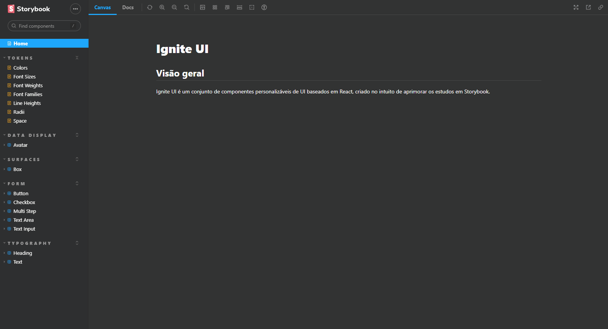

# Storybook Ignite UI

## Tabela de conteúdos

- [Storybook Ignite UI](#storybook-ignite-ui)
  - [Tabela de conteúdos](#tabela-de-conteúdos)
  - [Visão Geral](#visão-geral)
    - [A Aplicação](#a-aplicação)
    - [Captura de Tela](#captura-de-tela)
    - [Links](#links)
    - [Recursos utilizados](#recursos-utilizados)
  - [Pré-requisitos](#pré-requisitos)
  - [Autor](#autor)

## Visão Geral

### A Aplicação

Projeto criado para fiz de estudo de documentação com o Storybook.

Alguns comando foram muito interessantes no aprendizado para montar a estrutura para o Storybook. Assim como:

- Comando para criar um projeto Storybook utilizando Vite para um projeto React com Typescript

  > npx sb init --builder @storybook/builder-vite --type react --use-npm

- Instalar Vite como dependência de desenvolvimento

  > npm i vite @vitejs/plugin-react -D

### Captura de Tela

### Links

- URL da Aplicação: [Storybook Ignite UI](https://danilocalegaro.github.io/design-system-storybook/?path=/story/home--page)

### Recursos utilizados

- [TypeScrip](https://www.typescriptlang.org/) - Uma linguagem de programação fortemente tipada que se baseia em JavaScript.
- [PhosphorIcons](https://phosphoricons.com/) - Pacote de ícones
- [Storybook](https://storybook.js.org/) - Um workshop de front-end para criar componentes de interface do usuário e páginas isoladamente.

## Pré-requisitos

Para executar o projeto *local* utilizamos os comandos após realizar o download ou clone do repositório:

Instalar a dependencias do projeto:

> npm install

Logo em seguida para executarmos a aplicação:

> npm run dev

E a aplicação estará pronta para ser visualizada no endereço [http://localhost:6006](http://localhost:6006/).

## Autor

Danilo Calegaro - [danilocalegaro.dev.br](https://danilocalegaro.dev.br/)
